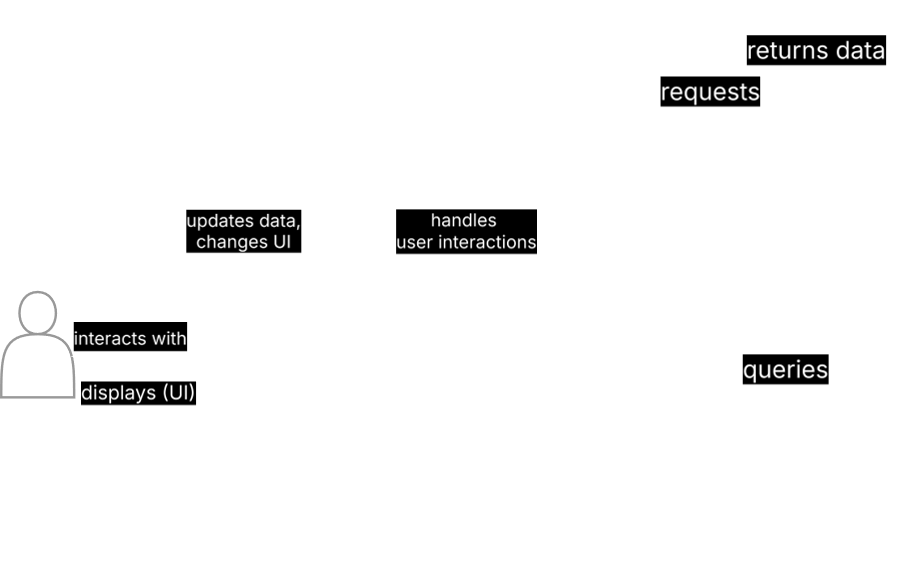
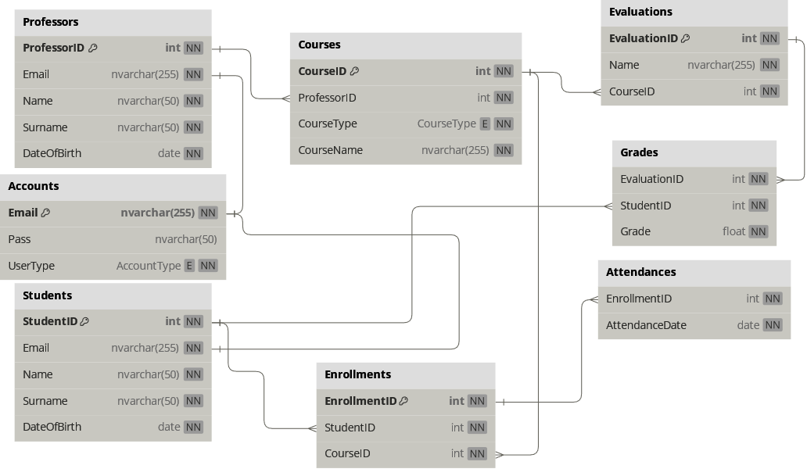

# WestUMS

WestUMS, as the acronym implies, is a University Management System, written in Java. It features a GUI created with Java Swing.
Users of the software include university system administrators (e.g. secretaries), professors and students at a university.

## Stack

- MySQL, JDBC
- Java, Java Swing

## Features

- An administrator can add students, professors and courses into the database.
- The administrator can also register an enrollment, i.e. link a student to a course.
- The administrator can import new data (new students, professors, courses, enrollments) using a JSON file
- Professors can view statistics regarding their taught course's attendance, as well as grades in exams and tests.

### Software architecture

- WestUMS is designed using the [MVC (Model, View, Controller) design pattern](https://www.geeksforgeeks.org/mvc-design-pattern/).
  - The view represents the user interface (UI) and everything visible to the user that they can interact with.
  - The controller acts as a **mediator** between the view and the model. It processes user interactions through the view, and whenever necessary calls upon the model to request data or to insert data in the database.
  - The model contains the lowest-level business logic, and interacts with the database directly. You will notice that all database queries are contained inside the model.
The following diagram shows how the application is designed, including example classes.

### Database design

The following diagram shows the schema of the databased used by the system.

### Password storage

The application stores passwords of users in hashed form instead of plain text. I took this project as an opportunity to learn about password hashing, salts the advantages and disadvantages of using reversible password hashing algorithms.

The application uses the `BCrypt` library, an implementation of the bcrypt hashing algorithm.

#### Password creation

When the user first logs in into their account, they must set a password. A *salt*, a unique randomly generated string, is used to hash the plain text password that the user enters. Then, the resulting hashed password is stored into the database. The `BCrypt` library stores the salt inside the hashed password.

#### Password validation

When a user who has already set a password for their account attempts to log in, the application does the following: It hashes the plain text password that the user entered using the salt stored inside the user's hashed password in the database, and compares the hashed password that results with the password entry in the database. If the two hashed strings match, user is granted access into their account.

#### Non-reversible

Since the bcrypt algorithm is non-reversible, anyone with direct database access to the passwords cannot decrypt the passwords to obtain them in their original form. The original (plain text) form of a password can only be obtained by finding a string, that when hashed with the stored salt, matches the stored database.

## Lessons Learned

- This is my first GUI project, and I realized that UI implementations (in programming) as a whole are very similar. For example:
  - Just like HTML, `JFrame` functions as an HTML file (a single page).
  - The `JPanel` functions as a `
` component in HTML.
- I also got introduced to the **MVC (Model, View, Controller)** software architecture/pattern, which 
  guided me on structuring my code and understanding the different modules my application should have.

## Possible Improvements

- Pre-importing data into the database, so that the user doesn't have to manually add students, professors and courses.
- Use an embedded database (e.g. H2, SQLite) that don't require the user to manually create the database and to start the server.
- Use a cloud database to allow users on different machines to have access to the same data.
- Implement database pooling, a method that can keep database connections open at all times, to avoid creating a database connection everytime the database needs to be queried or manipulated.
